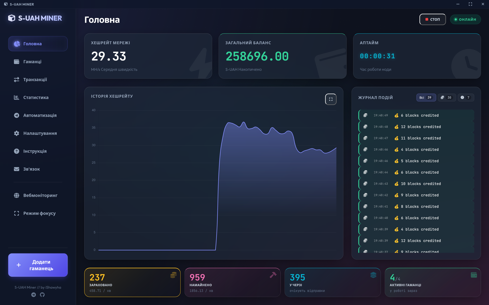
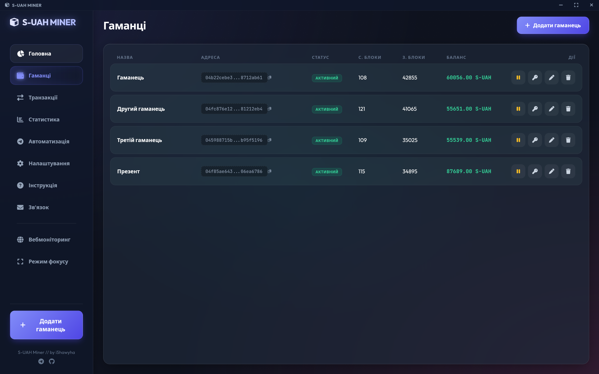
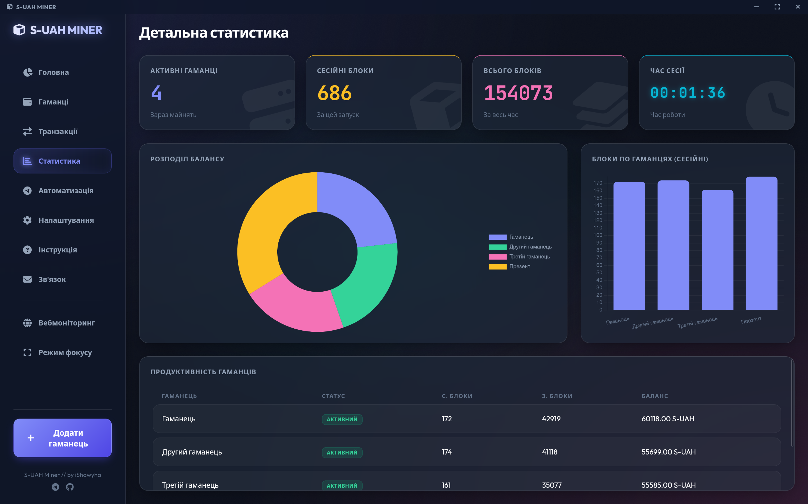
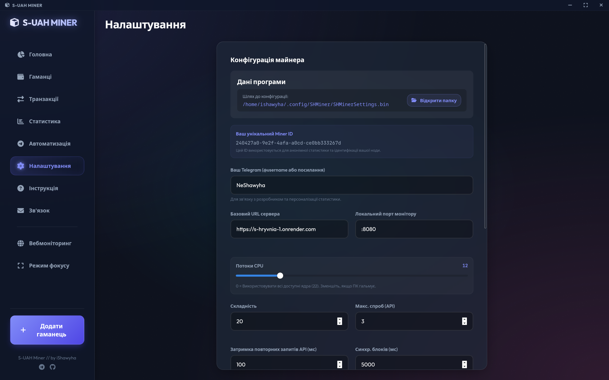
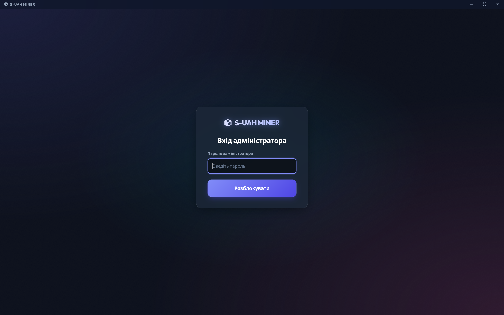
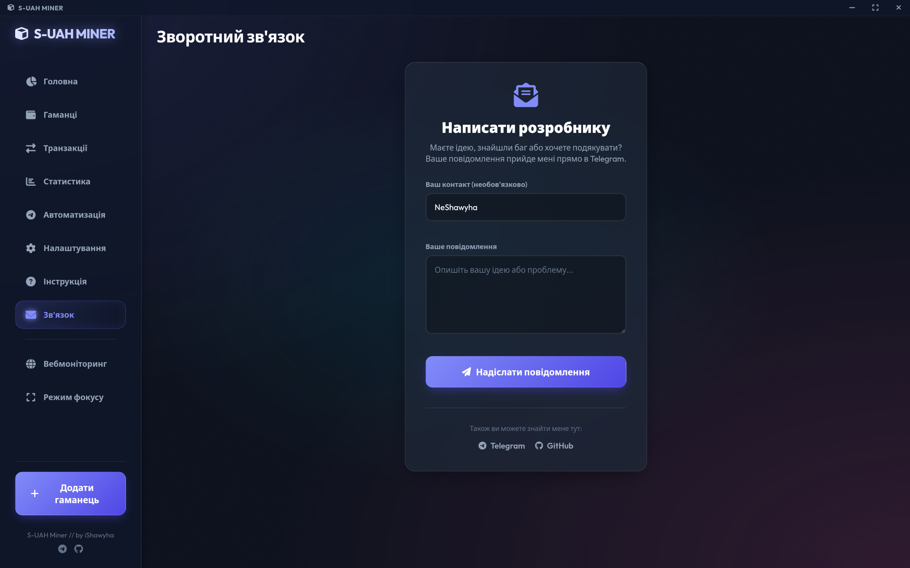
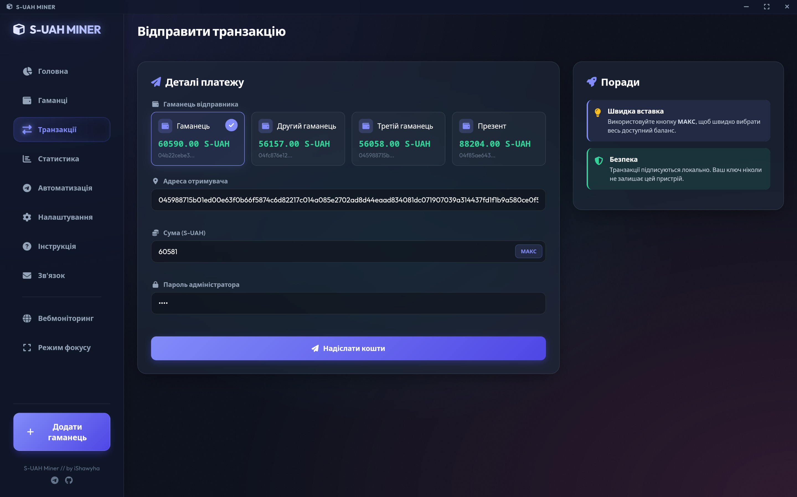
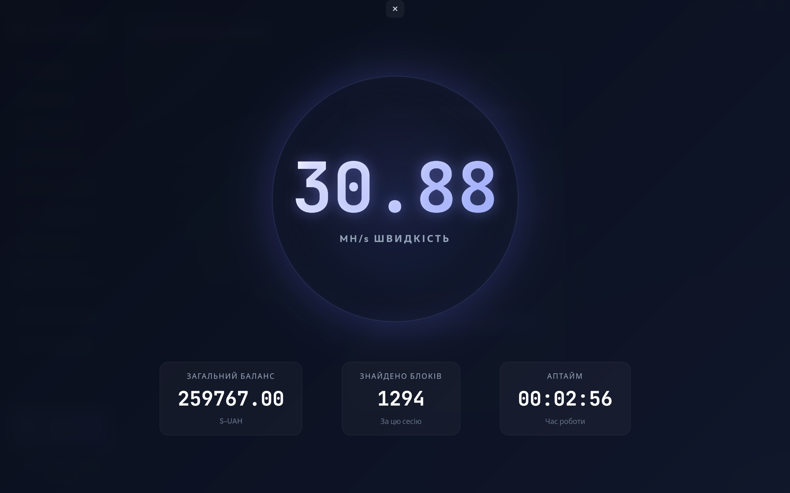
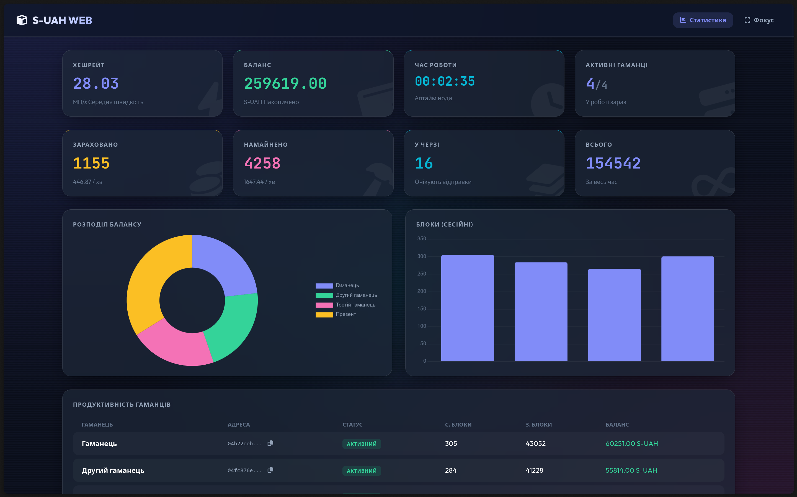

# Student-Hryvnia Miner (SHMiner)


**SHMiner** — це кросплатформний високопродуктивний десктопний додаток для майнінгу студентської цифрової валюти **Student-Hryvnia (S-UAH)**. Проєкт поєднує швидкість та паралельну обробку Go на бекенді з реактивністю Svelte на фронтенді, забезпечуючи зручний процес майнінгу з мінімальним навантаженням на систему.

## 🔥 Що це

SHMiner фокусується на шаленій ефективності, зручному інтерфейсі, безпечному локальному зберіганні гаманців та надійній взаємодії з мережевими вузлами. Усі ваші дані (гаманці, конфігурація) зберігаються виключно локально у зашифрованому вигляді — додаток не залежить від сторонніх серверів для авторизації. На відміну від звичайних майнерів, які простоюють в очікуванні відповіді від сервера, SHMiner використовує повністю асинхронну модель: процес обчислення хешів ніколи не переривається мережевими запитами, що дозволяє витиснути 100% потужності вашого CPU.

## 🚀 Основні можливості

* ⚡ **Ефективний CPU Майнінг** — оптимізовані обчислення SHA-256 для багатоядерних процесорів. Worker pool на goroutines забезпечує стабільний хешрейт.
* 🚀 **High-Speed Non-Blocking Mining** — Архітектура з розділеними потоками: майнінг-воркери фокусуються виключно на обчисленнях, поки окремий фоновий сервіс займається відправкою знайдених рішень (non-blocking POST).
* 💼 **Розширене керування гаманцями**:
  * Створення нових гаманців в один клік.
  * Імпорт/Експорт гаманців (вручну або у форматі JSON).
  * Перемикання та синхронізація кількох гаманців одночасно.
* 🔐 **Зашифроване сховище та Автологін** — усі чутливі дані надійно шифруються у локальному файлі `SHMinerSettings.bin`. Ви можете встановити пароль для максимального захисту або залишити його порожнім для зручного автоматичного входу.
* 📂 **Системна інтеграція** — налаштування зберігаються у стандартних директоріях ОС (`%APPDATA%` для Windows, `~/.config` для Linux/macOS), забезпечуючи надійну роботу без проблем з правами доступу.
* 📊 **Статистика в реальному часі** — моніторинг хешрейту, поточного балансу та кількості видобутих блоків через вбудований HTTP/WS сервер або прямо на вкладці "Статистика" в майнері.
* 📝 **Живі логи та Розумна обробка помилок** — перегляд деталей процесу (знайдені nonce, відповіді), механізми backoff та автоматичні повторні спроби при втраті з'єднання.
* 🧘 **Режим фокусу** — мінімалістичний інтерфейс для зручного спостереження за майнінгом без зайвих деталей.
* 🔄 **Автоматичне оновлення конфігурації** — застосування більшості змін без перезавантаження додатка.
* 📡 **Smart Telemetry** — Вбудована система моніторингу стану вашої ферми (через Cloudflare Workers), що дозволяє відстежувати стабільність та успіхи майнера в реальному часі. 
* 🪟 **Кросплатформність** — однаково добре працює на Windows, Linux та macOS. Повноцінний NSIS-інсталятор для Windows та DMG для macOS.
* 🛠 **Зв'язок з розробником** — Інтегрована система зворотного зв'язку для швидкого повідомлення про баги або пропозицій.

> *Телеметрія збирає лише технічні дані (хешрейт, версія ОС) і не передає ваші приватні ключі чи паролі.*

## 🏗 Архітектурна оптимізація

У версії v1.1.0 я відмовився від синхронної моделі "Compute -> Send -> Wait".
Зараз додаток працює за схемою **Producer-Consumer**:

1. **Mining Workers (Producers)** — Генерують хеші з максимальною швидкістю.
2. **Internal Queue** — Знайдені блоки миттєво потрапляють у внутрішню чергу.
3. **Network Dispatcher (Consumer)** — Окремий сервіс у фоні забирає блоки з черги та відправляє їх на сервер, не затримуючи процес майнінгу ні на мілісекунду.

## 🛠️ Технологічний стек та деталі

* **Backend**: Go (v1.26+) з багатопоточними службами (goroutines + atomic/Mutex + worker pool).
* **Frontend**: Svelte, TypeScript, Vite.
* **Framework**: Wails (v2).
* **Hashing**: Алгоритм SHA-256 (стандартна бібліотека `crypto/sha256`).

## 📸 Інтерфейс

### Головний екран


Тут ти бачиш поточний хешрейт, баланс, кількість видобутих блоків та активні потоки CPU.

### Керування гаманцями


Створюй нові гаманці, імпортуй існуючі або експортуй для бекапу. Перемикайся між кількома гаманцями.

### Статистика


Графіки хешрейту в реальному часі, детальна статистика роботи майнера.

### Налаштування


Налаштуй кількість потоків CPU, сервер, порт монітору, складність та інші параметри.

### Авторизація


Захисти свої дані паролем або використовуй автологін для зручності.

### Підключення


Ти можеш напряму написати розробнику з майнера і він миттємо отримає повідомлення.

### Транзакції


Транзакції між гаманцями. Можна відправляти свої монетки друзям або на свій інший гаманець.

### Режим фокусу


Мінімалістичний інтерфейс для спостереження за майнінгом без зайвих деталей.

### Веб-моніторинг


Відкрий дашборд у браузері на телефоні чи іншому пристрої в тій самій Wi-Fi мережі.

## ⚠️ Важливо

* Проєкт створено як технічний експеримент (в освітніх/дослідних цілях).
* Автор не несе відповідальності за стороннє використання або діяльність, що порушує правила сервісів.
* Конфіденційні дані не передаються третім особам.

## 📦 Встановлення

### 🎯 Швидке встановлення

| ОС | Команда |
|---|---------|
| **Arch Linux** | `yay -S shminer-bin` |
| **Ubuntu/Debian** | `sudo dpkg -i shminer_*.deb` |
| **Fedora/RHEL** | `sudo rpm -ivh shminer_*.rpm` |
| **Nix/Flakes** | `nix run github:OlexiyOdarchuk/Student-Hryvnia-Miner` |
| **AppImage** | `chmod +x shminer-*.AppImage && ./shminer-*.AppImage` |
| **Windows** | Завантаж `SHMiner-windows-amd64-setup.exe` з [Releases](https://github.com/OlexiyOdarchuk/Student-Hryvnia-Miner/releases/) |
| **macOS** | Завантаж `SHMiner-darwin-*.dmg` з [Releases](https://github.com/OlexiyOdarchuk/Student-Hryvnia-Miner/releases/) |

---

### 📥 Завантаження + Встановлення

#### macOS

1. Завантаж DMG файл (`SHMiner-darwin-*.dmg`) з [Releases](https://github.com/OlexiyOdarchuk/Student-Hryvnia-Miner/releases/)
2. Відкрий DMG та перетягни `SHMiner.app` у папку **Applications**
3. Запусти додаток з Launchpad або Spotlight

#### Windows

1. Завантаж **інсталятор** (`SHMiner-windows-amd64-setup.exe`) або **портативну версію** (`SHMiner-windows-amd64-portable.exe`) з [Releases](https://github.com/OlexiyOdarchuk/Student-Hryvnia-Miner/releases/)
2. Запусти інсталятор або просто запусти файл

#### Ubuntu / Debian

1. Завантаж пакет `shminer_*.deb` з [Releases](https://github.com/OlexiyOdarchuk/Student-Hryvnia-Miner/releases/)
2. Встанови: `sudo dpkg -i shminer_*.deb`
3. Якщо помилка залежностей: `sudo apt install -f`

#### Fedora / RHEL / openSUSE

1. Завантаж пакет `shminer_*.rpm` з [Releases](https://github.com/OlexiyOdarchuk/Student-Hryvnia-Miner/releases/)
2. Встанови: `sudo rpm -ivh shminer_*.rpm`

#### Arch Linux (AUR)

1. Встанови: `yay -S shminer-bin`
2. Або завантаж PKGBUILD з [shminer-bin](https://aur.archlinux.org/shminer-bin.git) і запусти: `makepkg -si`

#### Nix (Flakes)

1. Запусти без встановлення: `nix run github:OlexiyOdarchuk/Student-Hryvnia-Miner`
2. Або встанови в профіль: `nix profile install github:OlexiyOdarchuk/Student-Hryvnia-Miner`

#### AppImage

1. Завантаж `shminer-*.AppImage` з [Releases](https://github.com/OlexiyOdarchuk/Student-Hryvnia-Miner/releases/)
2. Зроби виконаваним: `chmod +x shminer-*.AppImage`
3. Запусти: `./shminer-*.AppImage`

#### З вихідного коду

```bash
# Попередні вимоги:
# - Go v1.26+
# - Node.js v22+
# - Wails CLI

git clone https://github.com/OlexiyOdarchuk/Student-Hryvnia-Miner.git
cd Student-Hryvnia-Miner
cd frontend && npm install && cd ..
wails build -clean -trimpath -ldflags "-s -w"
```

---

## ⚙️ Конфігурація

Додаток за замовчуванням підключається до основного сервера `https://s-hryvnia-1.onrender.com`. 
Усі налаштування зберігаються у системній директорії користувача. Ви можете швидко відкрити цю папку через кнопку **"Відкрити папку"** у вкладці налаштувань майнера.

### 📱 Доступ до дашборду з телефону в Wi-Fi

Вбудований HTTP/WS-дашборд тепер слухає на всіх мережевих інтерфейсах (`0.0.0.0:<порт>`), тож його видно не лише на `localhost`, а й на іншому пристрої в тій самій Wi-Fi/LAN-мережі — телефоні, планшеті, ноутбуку.

**Як користуватися кнопкою "Вебмоніторинг"** (у лівій бічній панелі)

1. Натисніть **Вебмоніторинг** у сайдбарі.
2. Додаток визначить ваш локальний IPv4 (наприклад `192.168.1.42`), підставить порт з налаштувань і скопіює готове посилання виду `http://192.168.1.42:8080` у буфер обміну через `navigator.clipboard.writeText` (із fallback на `document.execCommand('copy')`).
3. З'явиться сповіщення **"Посилання скопійовано!"**
4. Паралельно дашборд відкривається у локальному браузері на ПК через Wails `BrowserOpenURL` — стара поведінка збережена.
5. Вставте скопійоване посилання в браузер на телефоні — побачите ті ж самі графіки й баланс у реальному часі.

**Поради та обмеження**

* Комп'ютер і телефон мають бути в одній мережі (Wi-Fi/Ethernet).
* Якщо посилання не відкривається — дозвольте вхідні підключення на порт дашборду у брандмауері (Windows Defender Firewall / `ufw` / `firewalld`).
* Порт можна змінити у **Налаштуваннях → Локальний порт монітору**.
* VPN і `docker`/`virbr`/`veth`/`tun`-інтерфейси ігноруються при автовизначенні — беремо лише звичайний приватний IPv4.
* Якщо LAN-IP не знайдено, додаток відкриває `http://localhost:<порт>` лише на цьому ПК.

### Керування ресурсами (Settings)

У вкладці **Налаштування (Settings)** ви можете змінити параметри:

* **Кількість потоків CPU (Threads)**:
  * `0 (Auto)` — використовує максимум ядрер для продуктивності, залишаючи 1 ядро для системи.
  * `Власне значення` — обмеження кількості ядер.
* **Базовий URL сервера**: url, за яким звертається клієнт, щоб зарахувати успішний майнінг.
* **Локальний порт монітору**: порт, за яким розгортається сторінка з вебмонітором.
* **Складність**: кількість бітів "0", які очікує сервер для зарахування майнінгу.
* **Максимальна кількість спроб і затримка**: кількість спроб відправити знову хеш, якщо сервер не відповідає.
* **Оновити пароль**: Можливість змінити локальний пароль шифрування (або додати його, якщо ви використовували автологін).

## ✍️ TODO

* [x] Реалізувати миттєве завершення майнінгу при натисканні "СТОП".
* [x] Додати регулярну перевірку статусу блоку (чи не забрав його хтось інший) з можливістю налаштування частоти.
* [x] Реалізувати миттєве оновлення налаштувань при їх збереженні (без зупинки майнінгу).
* [x] Реалізувати автооновлення клієнта.
* [x] Реалізувати збір статистики клієнтів.
* [x] Додати NSIS інсталятор для `Windows`, щоб `SHMiner` автоматично встановлювався на систему та коректно оновлювався.
* [x] Додати пакет в `AUR` і зробити `.deb`, `rpm`, `nix`, та `AppImage` пакети для Linux-дистрибутивів.
* [x] Додати підтримку macOS з DMG-пакетами.
* [ ] Перейти на нову версію фреймворку Wails v3.

## 🤝 Внесок у проєкт

Пропозиції з покращення, звіти про помилки та Pull Requests завжди вітаються!

## 🔗 Посилання та контакти

* **Офіційний бот (Магазин)**: [@s_hryvnia_bot](https://t.me/s_hryvnia_bot)
* **Telegram автора**: [@NeShawyha](https://t.me/NeShawyha)
* **GitHub автора**: [OlexiyOdarchuk](https://github.com/OlexiyOdarchuk)

## 📄 Ліцензія

[GNU License](LICENSE)