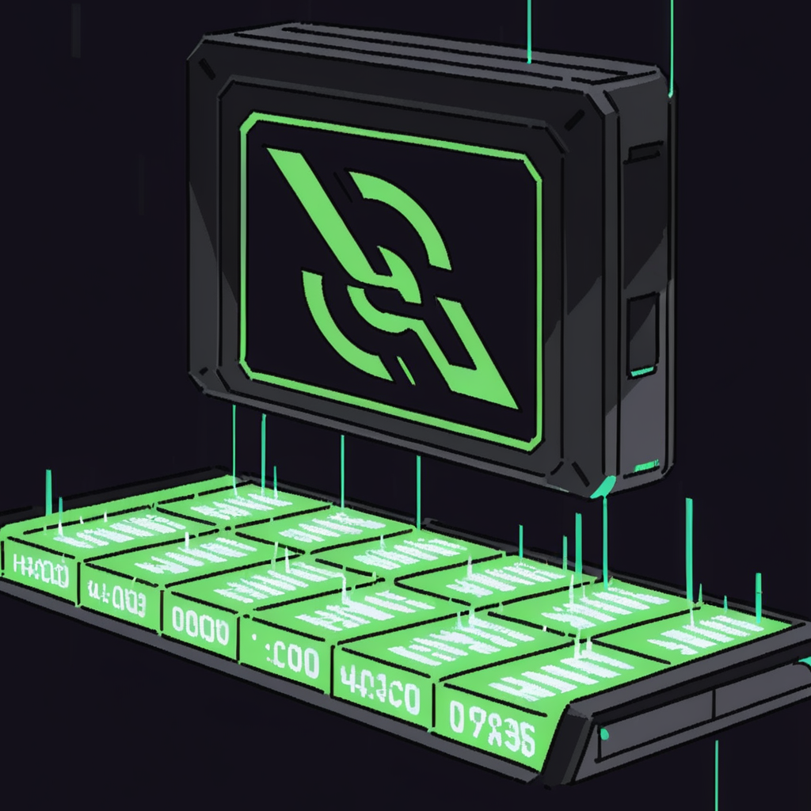

# S-Hryvnia Miner (SHMiner)

**SHMiner** — це кросплатформний високопродуктивний десктопний додаток для майнінгу студентської цифрової валюти **S-Hryvnia (S-UAH)**. Проєкт поєднує швидкість та паралельну обробку Go на бекенді з реактивністю Svelte на фронтенді, забезпечуючи зручний процес майнінгу з мінімальним навантаженням на систему.

## 🔥 Що це

SHMiner фокусується на шаленій ефективності, зручному інтерфейсі, безпечному локальному зберіганні гаманців та надійній взаємодії з мережевими вузлами. Усі ваші дані (гаманці, конфігурація) зберігаються виключно локально у зашифрованому вигляді — додаток не залежить від сторонніх серверів для авторизації.

## 🚀 Основні можливості

* ⚡ **Ефективний CPU Майнінг** — оптимізовані обчислення SHA-256 для багатоядерних процесорів. Worker pool на goroutines забезпечує стабільний хешрейт.
* 💼 **Розширене керування гаманцями**:
  * Створення нових гаманців в один клік.
  * Імпорт/Експорт гаманців (вручну або у форматі JSON).
  * Перемикання та синхронізація кількох гаманців одночасно.
* 🔐 **Зашифроване сховище** — усі чутливі дані надійно шифруються у локальному файлі `SHMinerSettings.bin`.
* 📊 **Статистика в реальному часі** — моніторинг хешрейту, поточного балансу та кількості видобутих блоків через вбудований HTTP/WS сервер або прямо на вкладці "Статистика" в майнері.
* 📝 **Живі логи та Розумна обробка помилок** — перегляд деталей процесу (знайдені nonce, відповіді), механізми backoff та автоматичні повторні спроби при втраті з'єднання.
* 🧘 **Режим фокусу** — мінімалістичний інтерфейс для зручного спостереження за майнінгом без зайвих деталей.
* 🔄 **Автоматичне оновлення конфігурації** — застосування більшості змін без перезавантаження додатка.
* 🪟 **Кросплатформність** — однаково добре працює на Windows, Linux та macOS.

## 🛠️ Технологічний стек та деталі

* **Backend**: Go (v1.25.6+) з багатопоточними службами (goroutines + atomic/Mutex + worker pool).
* **Frontend**: Svelte, TypeScript, Vite.
* **Framework**: Wails (v2).
* **Hashing**: Алгоритм SHA-256 (стандартна бібліотека `crypto/sha256`).

## ⚠️ Важливо

* Проєкт створено як технічний експеримент (в освітніх/дослідних цілях).
* Автор не несе відповідальності за стороннє використання або діяльність, що порушує правила сервісів.
* Конфіденційні дані не передаються третім особам.

## 📦 Встановлення та запуск

### Завантаження готових файлів (Releases)

Для більшості користувачів найпростіший спосіб почати — завантажити вже зібраний бінарний файл для вашої операційної системи з розділу **[Releases](https://github.com/OlexiyOdarchuk/Student-Hryvnia-Miner/releases/)**. 
Там є версії для:
* **Windows** (amd64 / arm64)
* **Linux** (amd64)

Просто завантажте файл, запустіть його та почніть майнінг!

Якщо вашої системи немає в списку, можете дуже легко встановити майнер, зібравши його з вихідного коду!

### Збірка з вихідного коду

#### Попередні вимоги

Переконайтеся, що у вас встановлено:

* [Go](https://go.dev/) (v1.25.6+)
* [Node.js](https://nodejs.org/) (v22+)
* [Wails CLI](https://wails.io/docs/gettingstarted/installation) (`go install github.com/wailsapp/wails/v2/cmd/wails@latest`)
* [Task](https://taskfile.dev/installation/) (необов'язково, але рекомендовано для зручності)

#### Використання Taskfile

Я додав `Taskfile.yml` для автоматизації розробки. Якщо у вас встановлено `task`, ви можете використовувати наступні команди:

* `task pull` — завантажити всі залежності (Go + npm).
* `task dev` — запустити додаток у режимі розробки (`wails dev`).
* `task build` — зібрати оптимізований бінарний файл для вашої ОС.
* `task test` — запустити всі тести бекенду.
* `task check` — виконати форматування, перевірку та тести одним махом.

#### Ручна збірка

Якщо ви не використовуєте `task`:

1. Встановіть залежності фронтенду: `cd frontend && npm install && cd ..`
2. Запуск у режимі розробки: `wails dev`
3. Збірка для продакшну: `wails build -clean -trimpath -ldflags "-s -w"`

Готовий файл буде знаходитися в директорії `build/bin`.

## 🎮 Використання

1. **Запустіть додаток**: Відкрийте зібраний файл або виконайте `wails dev`.
2. **Авторизація**: Встановіть або введіть пароль сесії для доступу та розшифрування локального сховища.
3. **Гаманці**: Перейдіть на вкладку **Гаманці**, створіть новий гаманець або імпортуйте існуючий.
4. **Майнінг**: Переконайтеся, що гаманець активний, і почніть майнінг. Додаток автоматично підключиться до пулу.
5. **Моніторинг**: Слідкуйте за процесом на вкладках **Головна**, **Статистика** або **Термінал**.

## ⚙️ Конфігурація

Додаток за замовчуванням підключається до основного сервера `https://s-hryvnia-1.onrender.com`.

### Керування ресурсами (Settings)

У вкладці **Settings** ви можете налаштувати параметри:

* **Кількість потоків CPU (Threads)**:
  * `0 (Auto)` — використовує всі доступні ядра для максимальної продуктивності.
  * `Власне значення` — обмеження кількості ядер, щоб залишити ресурси системи для інших задач (наприклад, фоновий майнінг).
* **Базовий URL сервера**: url, за яким звертається клієнт, щоб зарахувати успішний майнинг
* **Локальний порт монітору**: порт, за яким розгортається сторінка з вебмонітором
* **Складність**: кількість бітів "0", які очікує сервер для зарахування майнингу
* **Максимальна кількість спроб і затримка**: кількість спроб відправити знову хеш, якщо сервер не відповідає
* **Оновити пароль**: Можливість оновити ваш локальний пароль

## ✍️ TODO

* [ ] Реалізувати миттєве завершення майнінгу при натисканні "СТОП".
* [ ] Додати регулярну перевірку статусу блоку (чи не забрав його хтось інший) з можливістю налаштування частоти.
* [ ] Реалізувати миттєве оновлення налаштувань при їх збереженні (без зупинки майнінгу).
* [x] Реалізувати автооновлення клієнта
* [ ] Реалізувати збір статистики клієнтів
* [ ] Перейти на нову версію фреймворку Wails v3.
* [ ] Додати NSIS інсталятор для `Windows`, щоб `SHMiner` автоматично встановлювався на систему. Додати пакет в `AUR` і зробити `.deb` і `AppImage` пакети

## 🤝 Внесок у проєкт

Пропозиції з покращення, звіти про помилки та Pull Requests завжди вітаються!

## 🔗 Посилання та контакти

* **Офіційний бот (Магазин)**: [@s_hryvnia_bot](https://t.me/s_hryvnia_bot)
* **Telegram автора**: [@NeShawyha](https://t.me/NeShawyha)
* **GitHub автора**: [OlexiyOdarchuk](https://github.com/OlexiyOdarchuk)

## 📄 Ліцензія

[GNU License](LICENSE)
